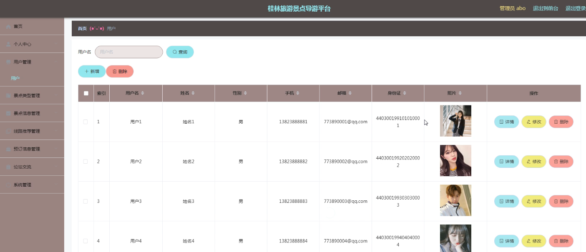
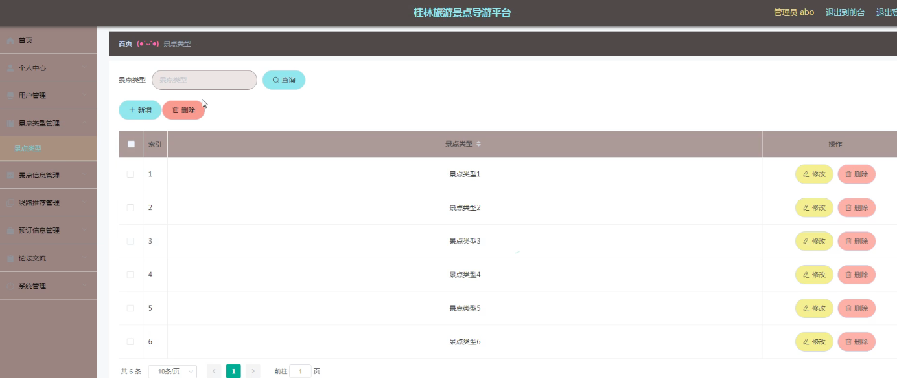
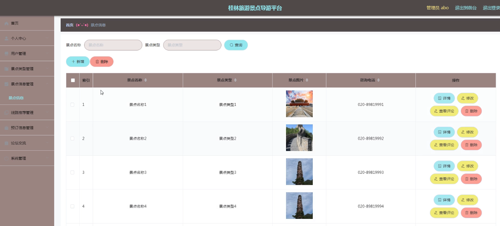
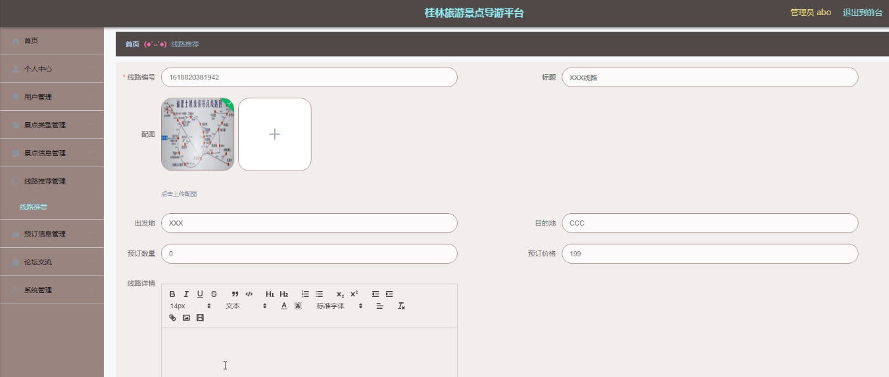
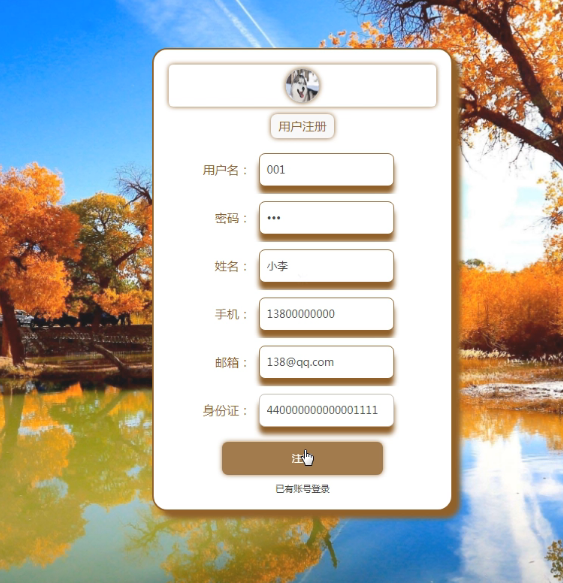
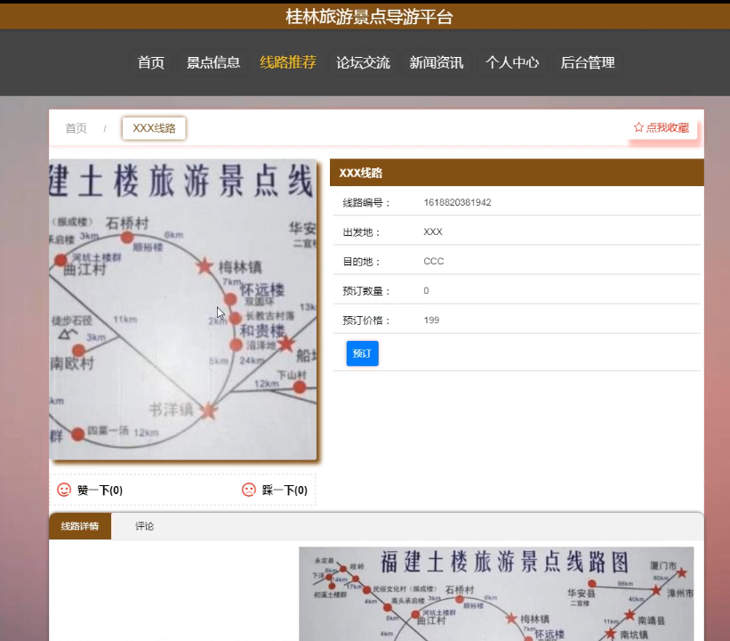
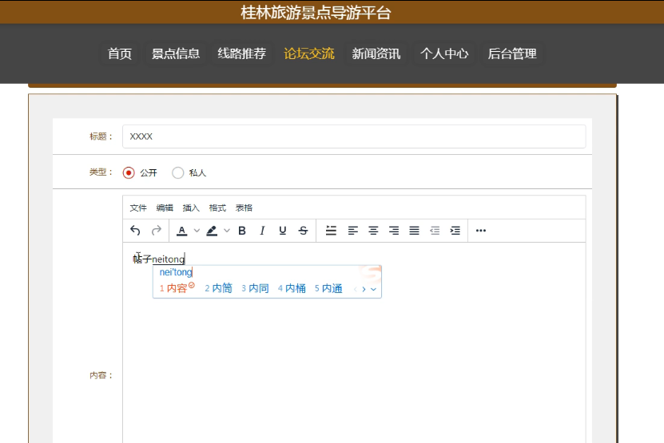

**项目简介：**  
本项目基于主流的前后端分离架构，采用 **SpringBoot + Vue 技术栈**，配套 **MySQL 数据库**，适用于毕业设计与课题实训开发。  
本人已整理了超 **4000 多套毕业设计源码+论文+开题报告+PPT...**，涵盖 **Java、SpringBoot、Vue、SSM、uni-app 小程序、PHP、Android** 等方向，支持功能修改定制与论文服务。  
**团队提供以下服务：**  
- 项目代码修改与调试  
- 数据库配置与远程协助  
- 论文定制与修改  
**获取更多的4000多套源码或SQL文件请联系：**  
- QQ：3906443360 微信：BesheHelp

# springboot068桂林旅游景点导游平台

（1）管理员信息的实体属性图如下：

图4.12  管理员信息实体属性图

（2）新闻资讯信息实体属性图如图4.13所示：

图4.13  新闻资讯信息实体属性图

（3）景点类型信息实体属性图如图4.14所示：

图4.14 景点类型信息实体属性图

4.3.2数据库设计表

桂林旅游景点导游平台需要后台数据库，下面介绍数据库中的各个表的详细信息：

表4.1 景点信息评论表

表4.2 线路推荐评论表

表4.3 论坛交流

表4.4 景点类型

表4.5 景点信息

表4.6 新闻资讯

表4.7 收藏表

表4.8 管理员表

表4.9 线路推荐

表4.10 用户

表4.11 预订信息

5系统详细实现

5.1 管理员模块的实现

5.1.1 用户信息管理

桂林旅游景点导游平台的系统管理员可以管理用户，可以对用户信息添加修改删除以及查询操作。具体界面的展示如图5.1所示。

图5.1 用户信息管理界面

5.1.2 景点类型管理

系统管理员可以查看对景点类型进行添加，修改，删除以及查询操作。具体界面如图5.2所示。

图5.2 景点类型管理界面

5.1.3 景点信息管理

系统管理员可以对景点信息进行添加，修改，删除以及查询操作。界面如下图所示：

图5.3 景点信息管理界面

5.1.4 线路推荐管理

系统管理员可以对线路推荐进行添加修改删除操作。界面如下图所示：

图5.4 线路推荐管理界面

5.2 用户模块的实现

5.2.2 用户注册

用户需要注册信息。界面如下图所示：

图5.5 用户注册界面

5.2.3 线路推荐

用户登录后，就可以看到线路推荐，可以对推荐线路进行预定。界面如下图所示：

图5.6 线路推荐界面

5.2.3 论坛交流

用户登录可以在论坛交流。界面如下图所示：

图5.7 论坛交流界面